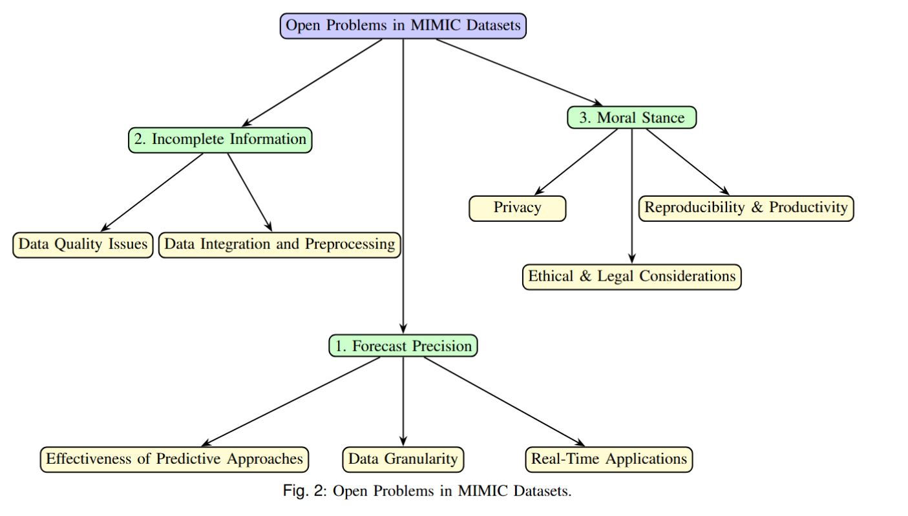

#  Leveraging MIMIC Datasets for Better Digital Health: A Review on Open Problems, Progress Highlights, and Future Promises

https://arxiv.org/abs/2506.12808#:~:text=Although%20numerous%20studies%20and%20surveys%20have%20explored%20the,comprehensive%20survey%20that%20focuses%20uniquely%20on%20open%20problems.

> **Abstract**: The Medical Information Mart for Intensive Care (MIMIC) datasets have become the Kernel of Digital Health Research by providing freely accessible, deidentified records from tens of thousands of critical care admissions, enabling a broad spectrum of applications in clinical decision support, outcome prediction, and healthcare analytics. Although numerous studies and surveys have explored the predictive power and clinical utility of MIMIC based models, critical challenges in data integration, representation, and interoperability remain underexplored. This paper presents a comprehensive survey that focuses uniquely on open problems. We identify persistent issues such as data granularity, cardinality limitations, heterogeneous coding schemes, and ethical constraints that hinder the generalizability and real-time implementation of machine learning models. We highlight key progress in dimensionality reduction, temporal modelling, causal inference, and privacy preserving analytics, while also outlining promising directions including hybrid modelling, federated learning, and standardized preprocessing pipelines. By critically examining these structural limitations and their implications, this survey offers actionable insights to guide the next generation of MIMIC powered digital health innovations.

https://arxiv.org/pdf/2506.12808

---


###  Open Problems in MIMIC Datasets.

---


### 🎯 Key Contributions


In this paper, we address these gaps by providing a structured and comprehensive review of MIMIC-based research, categorizing previous work into two broad domains.
 -  Traditional clinical and computational applications, and
 -  Novel and advanced data mining approaches.
 -  We also present a unified taxonomy of use cases, identify persistent methodological challenges, and highlight emerging opportunities at the intersection of artificial intelligence and clinical relevance.

###  Datasets
MIMIC-III Critical Care Dataset
The Medical Information Mart for Intensive Care III (MIMIC-III)  is a publicly available dataset containing de-identified health data for 46,520 ICU patients (2001-2012) at Beth Israel Deaconess Medical Center. This multimodal dataset includes:

 Clinical Data
   
     58,976 hospital admissions (38,597 distinct adults)
     26,870 ICU stays (mean duration: 3.4 days)
  
    
  Time-Series

       4,000+ variables (vitals, labs, inputs/outputs)
       1.2 billion+ charted events (median 1,753/patient)

    
 Multidimensional Records
 
     Free-text notes (2.1 million nursing notes)
     ICD-9 diagnoses (average 13.2 per admission)
     SAPS-II/SOFA scores for severity assessment

  Preprocessing

    Temporal Alignment
  
          Unified timesteps (1-hour resolution)
          Forward-fill for sparse measurements (max gap = 6hrs)
   
    
   Feature Selection
  
        72 clinically relevant variables selected
        Missingness threshold: >80\% excluded
  
  Normalization 

        Z-score for continuous variables
        One-hot encoding for categoricals


## Citation
If you use this framework, please cite our work:

```bibtex
@misc{khaled2025leveragingmimicdatasetsbetter,
      title={Leveraging MIMIC Datasets for Better Digital Health: A Review on Open Problems, Progress Highlights, and Future Promises}, 
      author={Afifa Khaled and Mohammed Sabir and Rizwan Qureshi and Camillo Maria Caruso and Valerio Guarrasi and Suncheng Xiang and S Kevin Zhou},
      year={2025},
      eprint={2506.12808},
      archivePrefix={arXiv},
      primaryClass={cs.CV},
      url={https://arxiv.org/abs/2506.12808}, 
}
